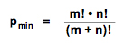
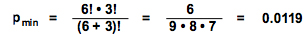

## Comparing Overlays

To compare overlays using a statistical test, SPICE performs a permutation analysis using a figure called *Permutation Test*. This test asks how often, given the samples that comprise the compared pies, the difference observed would happen simply by chance. This offers a more accurate view of similar-looking pie figures, allowing you to determine with more precision just how "alike" they really are.

>Note: This is the same functionality as the "Compare Pies" option in SPICE 5. The comparison isn't specific to pie figures but rather more to *overlays* in your query. In SPICE 6, you don't have to have any pie figures in your query group in order to use the Permutation Test figure. You need only *two or more overlays*.

For example, if you are comparing two overlays, one representing 10 individual samples, and the other representing 30 individual samples, there are a total of 40 samples. SPICE compares the two overlays for the original distribution, by summing the square of the difference of the size of each of the categories across overlays (the slices of the pies). A large value of this sum indicates that the two overlays are different; a sum of zero would result from comparing identical pies. SPICE then runs through a large number of simulations (by default, 10,000, as specified in the *iterations* field in the Figure Format panel). For each simulation, it randomly assigns the samples to the two overlays (in our example, 10 to one overlay and 30 to the other), and the compares the resulting overlays. SPICE records the number of times that the comparison results in a greater difference than the original comparison: if this happens frequently, then it is likely that the original overlays are not different; conversely, if it rarely happens, then it is likely that the difference between the overlays was not just random.

The figure is in the form of a table. These p values are the proportions of times that the permutation test generated sample distributions that are less alike than the original comparison. The smallest p value that can calculated is determined by the number of permutations run; if you reduce the number of permutations to 100 (to speed up the calculations), then the lowest p value will be 0.01. Color coding is used to highlight comparisons that result in nominally significant values, with darker colors associated with lower p values.

Obviously, the power to detect differences between the overlays will depend on how many samples are included in each pie. If only a few samples were averaged to generate the query, then it will be virtually impossible to assign statistical significance to any differences using the permutation test. To determine the minimum p value that you can quantify, use the formula below:

where m and n are the number of samples in the two pies. For example, if you are comparing a pie with 6 subjects to one with 3 subjects, then the minimum p value will be the greater of 1/Permutations (by default, 1/10,000, or 0.0001) and

When SPICE compares the overlays, it compares the size of each category between the two overlays. It sums up the differences over all categories to determine the overall difference. This overall difference is used in the permutation test described above. The variability in this value between samples contained in each overlay might be reduced if you reduce the number of categories (for instance, by averaging or summing over certain variables); this may affect the p values.

[Return To Analysis Index](analysis)