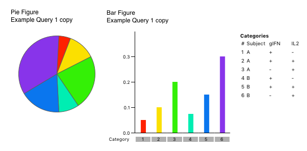
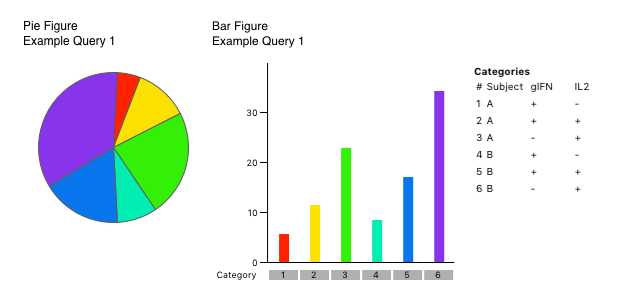

## Relative vs. Absolute Scaling

One of the controls in the "Bar Chart" section controls whether statistics are performed on "relative" scales or "absolute" scales. It is very important to understand the difference between these two operations.

Consider the following data (provided in the file, `Demo Data 1.csv`, which can be imported into SPICE using the File Open menu). In this experiment, cytokine responses for two patients have been measured, and divided into cells making gIFN, IL2, or both.

<table border="1" align="center" cellspacing="0" cellpadding="3">
	<th>Subject</th>
	<th>gIFN+IL2+</th>
	<th>gIFN–IL2+</th>
	<th>Value</th>
	<tr>
		<td width="25%" align="center">A</td>
		<td width="25%" align="center">0.1</td>
		<td width="25%" align="center">0.05</td>
		<td width="25%" align="center">0.2</td>
	</tr>
	<tr>
		<td width="25%" align="center">B</td>
		<td width="25%" align="center">0.15</td>
		<td width="25%" align="center">0.075</td>
		<td width="25%" align="center">0.3</td>
	</tr>
</table>

The values in this table are considered to be "absolute" values. In creating "relative" values, we express each value as a proportion of some group of values.  One way to do this is to express the data as a fraction of the total response *within each subject*.

<table border="1" align="center" cellspacing="0" cellpadding="3">
	<th>Subject</th>
	<th>gIFN+IL2+</th>
	<th>gIFN–IL2+</th>
	<th>Value</th>
	<tr>
		<td width="25%" align="center">A</td>
		<td width="25%" align="center">0.28</td>
		<td width="25%" align="center">0.14</td>
		<td width="25%" align="center">0.56</td>
	</tr>
	<tr>
		<td width="25%" align="center">B</td>
		<td width="25%" align="center">0.28</td>
		<td width="25%" align="center">0.14</td>
		<td width="25%" align="center">0.56</td>
	</tr>
</table>

You will notice that the two subjects now appear identical: the "flavor" of the response is in fact identical, in that the same proportion of the total response is present in each of the three categories. However, the patients are different, in that the total response in patient B is 50% greater than that of patient A.

Shown below the figures that SPICE generates for this dataset, for the two settings of "Absolute" scale (top) and "Relative" scale (bottom). In absolute scale, you can see that the two subjects look a little different (Subject B has bigger responses); in relative scale, the two patients are identical.

Note that the Pie charts, which per force must show "relative" scale (a proportion of the total), appear identical between the two settings. This is because in fact the patients are identical in terms of their "flavor".

But this will not always be the case, and whether you choose absolute or relative scaling can dramatically impact the view of the data. In the data file `Demo Data 2`, there are an additional 8 subjects included in this same kind of analysis. 9 of the 10 subjects are nearly identical in flavor; however, the 10th ("J") is significantly different, having a very large gIFN+IL2+ value of 22.

 vs. Relative (right) Pies")

The graphs shown above were generated by "Grouping" across the ten subjects. The graph on the right is "relative", and on the left is "absolute". Note how different the Pie Charts are for these two settings!

To understand why, consider that in the "relative" setting, the Pie charts show you the "average flavor"; in the "absolute" setting, the Pie charts show you the "flavor of the averages". In "relative" setting, the fact that subject J has a total response that is 100 times as large as the other subjects is irrelevant: the values are normalized to 100% (fraction of total), before they are averaged. Hence, Subject J's unusual flavor contributes only 1/10th of the variability to the flavor, and the Pie Charts are reflective of the vast majority of subjects. However, in the "absolute" setting, the Pie chart is generated based on the average of each category. Now Subject J's unusually high response in one category dominates because of the very high representation: the flavor is weighted by the total response. In this case, the Pie charts reflect primarily the flavor of Subject J, not the other 9 subjects.

Clearly, in this case, you would want to use "relative" scaling, or at least choose to "ignore" subject J, as subject J is not representative of the group as a whole. However, there are times when you do want to use "absolute" scale for statistical comparison. These are times when you want the data to be reflective of the total contributions; i.e., when large responses should be weighted more heavily than small responses rather than equally. Consider carefully what you are trying to analyze before you choose this option; of course, it is easy to turn it on and off and see the effect!

Note that if all of your samples have total responses that are very similar in magnitude, then this option will have little or no effect on the data visualization. It is only relevant when you are trying to compare samples that have potentially widely different total responses. Use "Relative Scaling" if you are interested in the "average flavor".

[Return To Analysis Index](analysis)
