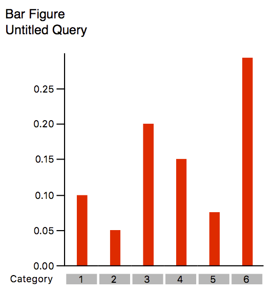
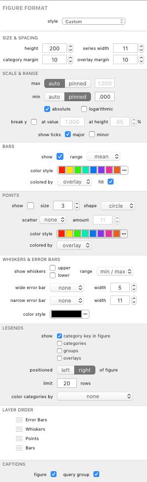

## Bar Figures

The bar figure represents the values for each category. Each category is represented by one or more bars (or sets of points), depending on how many [overlays]() are displayed. It is easily the most flexible graph available in terms of customizability. Though it's called a "bar figure", it can display bars, points, box plots, etc.

### Formatting Options

A bar's visual appearance can be edited in the Figure Format panel when the bar figure is selected. Each group is described below.

#### Size &amp; Spacing

The *height* field controls the total height of the **plot area** of the bar figure. The figure itself will be taller, depending on selected formatting options (such as legends, etc.).

The *series width* field controls the width of the bars or area available to groups of points.

The *category margin* field controls the spacing between each category (each bar or group of points).

The *overlay margin* field controls the spacing between overlays (each bar within a category when overlays are displayed).

#### Scale &amp; Range

The *max* and *min* controls allow the figure to determine the best scale in *auto* mode and allow you to specify a value for each in *pinned* mode using the fields beside each control.

The *absolute* checkbox displays the data in absolute scale; uncheck to display in relative scale.

The *logarithmic* checkbox displays the data in logarithmic scale.

The *break y* controls allow you to break the scale along the y axis. Check the checkbox to enable this feature. Use the fields to specify the data value and height (in terms of percent of plot area height) for further customization.

The *show ticks* boxes affect the display of the y axis scale. You can toggle major and minor ticks.

#### Bars

The *show* checkbox toggles displaying of bars. 

The *range* control lets you specify the bar ranges. You can choose between *mean*, *median*, *min/max*, and *IQR* (interquartile range).

The *color style* control allows you to manage the color scheme used for the bars. The *colored by* control below it affects whether to assign the above color style by *overlay* (default) or by *category*. Colors are discussed more in [Color Schemes](guide-colorschemes).

The *fill* checkbox affects whether the bars are filled or empty. When unchecked, only the outlines of the bars are drawn (in the form of a stroke of the color specified by the color controls).

#### Points

The *show* checkbox toggles displaying of points. 

The *size* field specifies the size in (screen) points of each individual drawn point, while the *shape* control lets you choose from a variety of point shapes (such as *circle*, *square*, *diamond*, and *triangle*).

The *scatter* controls let you choose whether to scatter the points (in the x axis direction) about the center of the series (the center of where the bar would be drawn if shown). Choose *none* to have all points drawn on the x-axis center of the series, drawing atop one-another if necessary. Choose *grape* or *slope* to scatter the points in the desired pattern. The *amount* field specifies the pixel width within which the points can be scattered along the x axis. This amount can be greater than the series width if series overlap is desired.

> Tip: With scatter set to none, you can still see overlapping points using a simple trick. Click the ••• button on the the point color style control. In the color style manager that pops up, drag the *opacity* slider to the half-way mark or somewhere visually pleasing and note the change in your overlapping points. Heavier areas of overlap become obvious as the points get darker by blending together as translucent objects.

The *color style* control, as with the Bars color control above, allows you to manage the color scheme used for the points. The *colored by* control below it affects whether to assign the above color style by *overlay* (default) or by *category*. Colors are discussed more in [Color Schemes](guide-colorschemes).

#### Whiskers &amp; Error Bars

The *show whiskers* checkboxes (*upper* and *lower*) toggle whisker display. The *range* control lets you choose a whisker range of *standard deviation*, *standard error of mean*, *min/max*, or *interquartile range*.

The *wide error bar* control lets you choose to show (or not to show) a wide error bar representing the *mean* or *median*. The *width* control beside it lets you specify the width (centered on the series) of the bar (note: "width" is not the same as "thickness" of the bar itself).

The *narrow error bar* lets you choose to show (or not to show) a narrow error bar representing the *whisker range*, *interquartile range*, or the *min/max* of the series. The *width* control beside it lets you specify the width (centered on the series) of the bar (note: "width" is not the same as "thickness" of the bar itself).

The *color style* control allows you to manage the color scheme used for the bars. By default, bars are displayed in single-color (black) mode. Colors are discussed more in [Color Schemes](guide-colorschemes).

#### Legends

Legends can be displayed for various properties of the figure.

The *show* checkboxes allow you to toggle specific legends on and off.

The *positioned* control lets you choose the position of the legends, as a whole, relative to the pie or pies.

The *limit* field controls the maximum number of items to show in the shown legends.

The *color categories by* control lets you select a pie figure (if any exist) whose category color scheme your category legend can borrow. When a pie figure is selected the category legend and category key (if shown) are given color keys corresponding to the color scheme defined by the pie's category color scheme. If a selected pie figure is deleted from your document, the figure remains selected here until it is deselected. This allows you to use the pie's color scheme without it appearing in your outline (and, incidentally, simplifies undo / redo behavior when deleting figures).

#### Layer Order

This control allows you to specify the order in which the layers of the bar figure are drawn. This gives you a great deal of formatting flexibility. For example, you may want whiskers and error bars to be drawn *below* points, rather than the default *above*. To change the order, drag a layer to its new location. The layer order is "bottom-up", meaning the bottom most layer in the list is drawn first, then the next one up is drawn atop the last, etc. By default, bars are drawn first, followed by points, then whiskers, then error bars.

#### Captions

The *figure* caption checkbox shows or hides the figure's title in the exported graphic.

The *query group* caption checkbox shows or hides the figure's query group's title in the exported graphic.

[Return to Figure Types Index](guide-figuretypes) &middot; [Return to Guide Index](guide)
