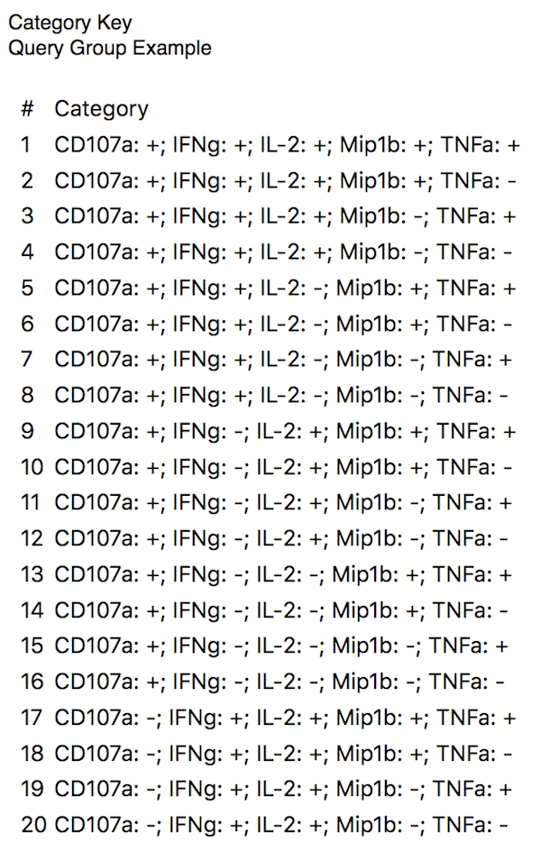
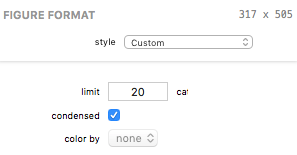

## Category Key Figures

A Category Key figure displays a table of the result categories.

### Formatting Options

A Category Key visual appearance and test parameters can be edited in the Figure Format panel when the bar figure is selected. Each control is described below.

The *limit* field allows you to specify the maximum number of categories to display in the key.

The *condensed* checkbox, when checked, results in a simple two-column key with the category number and a condensed description of the category. When unchecked, the table shows a column for the category number and one column for each categorical variable.

The *color by* control lets you select a pie figure (if any exist) whose category color scheme your category key can borrow. When a pie figure is selected the category key are given color keys corresponding to the color scheme defined by the pie's category color scheme. If a selected pie figure is deleted from your document, the figure remains selected here until it is deselected. This allows you to use the pie's color scheme without it appearing in your outline (and, incidentally, simplifies undo / redo behavior when deleting figures).

[Return to Figure Types Index](guide-figuretypes) &middot; [Return to Guide Index](guide)
