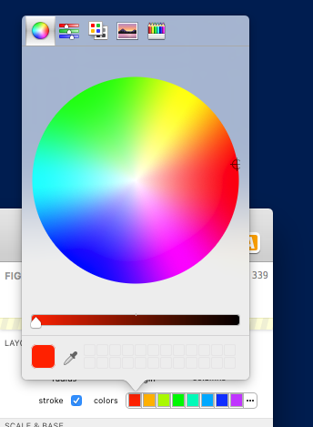
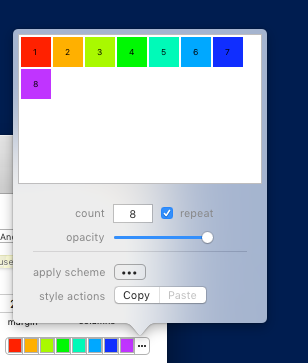
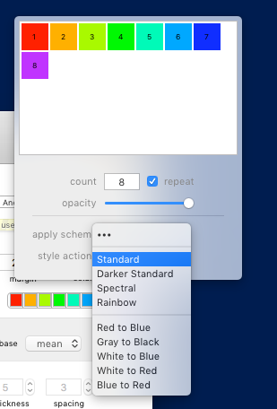

## Color Schemes

Color schemes in SPICE 6 allow you to choose a set of colors to assign to figure elements such as bars, points, lines, pie slices, etc. This gives you the ability to automate assigning colors by category, group, or overlay in many [figure types](guide-figuretypes).

> Note: In SPICE 5, color schemes were either "custom" (fully-user-defined colors) or they followed an automatic scheme (such as "Red-to-Blue"). Automatic schemes would grow or shrink automatically to fit the number of result categories (or groups or overlays) they represented. That means a red-to-blue scheme with two categories would result in two colors: red and blue, while three categories would result in three colors: red, purple (halfway between red and blue), and blue. This meant, for very large numbers of colors, two adjacent categories may have an indistinguishable difference in color. In SPICE 6, the controls described below allow more flexibility and effectively solve this problem by allowing a specific count to be set and giving users a choice whether or not to repeat the pattern when you run out of colors.

### Color Scheme Properties

A color scheme has several basic properties:

#### Color Count

This is the number of colors in the scheme. For example, if you have 8 categories, choose 8 colors. Colors beyond this range (say, category 9 in an 8-color scheme) can either use a repeat of the pattern defined by the scheme, or black. See Repeat below.

The color count affects how color functions are applied. See Color Functions below. The color count can also be set to 1 for single-color mode.

#### Colors

The actual colors contained in the scheme. In a 3-color scheme (the count set to 3), you may have the first as red, the second as green, and the third as blue. The colors can be individually edited (see the user interface summary below) or assigned using the Function menu (see Color Functions below).

#### Repeat

The repeat property designates a repeating color pattern. If you have a 4-color scheme assigned to a pie figure's slices but the pie has 8 slices (result categories), you can choose *repeat* to reuse the 4-color pattern. That means the color pattern will start over again on the fifth slice/category and keep repeating as much as needed for the given number of slices/categories.

If you choose *not* to repeat the pattern, any colors beyond the color count (the fifth slice in a 4-color scheme) will be black. Our experience has shown that, with large numbers of result categories, a 16-color scheme on repeat keeps the colors distinct enough from their immediate neighbors while still making it easy enough to find *which* "red slice" you're looking at in a legend.

#### Opacity

The opacity affects all colors in the scheme. This allows you to make elements of the plotted figures translucent. For example, if you have a bar figure showing points without using the point scatter option, you'll very likely end up with many overlapping points. Using a 50% opacity color scheme for your points allows you to see easily (through the blending - and resulting gradual darkening - of the overlapping points) areas of high overlap density.

### The Color Scheme User Interface

The color scheme control is a complex control with several levels of detail, which are described below.

#### The Color Scheme Control

The color scheme control appears in many figures' format options (sometimes several times each). It appears as in the image above. In a pie figure's formatting settings, for example, there are two color schemes: one under the Layout &amp; Appearance group (which controls the pie slice / category color scheme) and one under the Arc Notation group (which affects the pie arc color scheme).

The control will show up to 16 colors both to allow you to see an example of the colors and to allow you to edit individual colors with a single click. The control's last (rightmost) button titled "•••" shows a more detailed options panel (covered below).

To edit an individual color directly, simply click on the color. In the example above, the first button (red) was clicked. Simply choose a new color and the figure (and color control) will update to show this new selection (as will any other figures in the case of a [shared style](guide-sharedstyles)). To change anything else (including colors beyond the maximum 16 displayed in the main color control), click the "•••" button for more options.

#### The Options Panel

In the image above, the color scheme options popover is shown. 

At the top you can see an expanded view of the colors in the scheme. You can click each color to edit them in the same way as with the basic control as discussed above. The count, repeat, and opacity are controlled using the controls below the color list as well.

Beneath the dividing line are two controls that need a bit more detailed explaining.

##### Color Functions (Apply Scheme)

The *apply scheme* control lets you choose from a list of predefined color functions (such as red-to-black, spectral, gray-to-black, etc.) and apply those colors to your scheme. This is a "one-off" action and, unlike SPICE 5, is not automatically updated with the color count (see the *note* above). That is, if you change the color count, you will need to re-apply a color function using this control. The chosen function will divide the colors evenly across the gradient of the function by the color count.

The example above shows the available functions that can be applied to your scheme. To apply a function, click the *apply scheme* button and choose the desired function.

##### Style Actions

Color schemes can be copied from any color control and pasted onto any other color control, across multiple documents or within the same document (independently of [shared styles](guide-sharedstyles)). Using the style actions buttons you can copy a style from one control, then open the options of another color scheme control and paste the copied styles. The source color scheme's settings are copied to the new color scheme.

[Return to Guide Index](guide)
