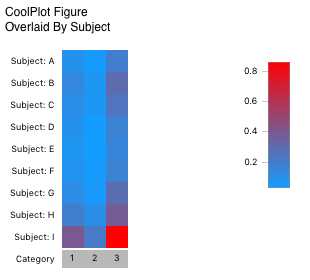
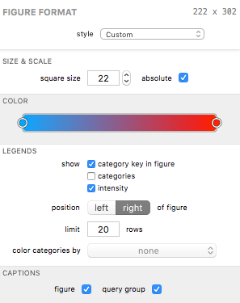

## CoolPlot Figures

The CoolPlot figure allows you to compare patterns of responses across a large number of samples quickly. Each row in the figure represents one [overlay](analysis-comparingoverlays); each column represents one category - i.e., each cell in the figure is colored according to its corresponding value of one slice of a pie in a pie figure.

When absolute scale is chosen, the color map is scaled to the minimum and maximum values of all cells. For relative scale, values are first normalized within each row (to a percentage) and then colored on a scale of 0-100% (this corresponds directly to what would be shown in a pie figure).

### Formatting Options

A CoolPlot's visual appearance can be edited in the Figure Format panel when the bar figure is selected. Each group is described below.

### Size &amp; Scale

The *square size* field affects the size (in screen points) of each cell (a size of 22 would result in all cells being 22x22 points in size).

The *absolute* checkbox displays the data in absolute scale; uncheck to display in relative scale.

### Color

The color control is unique to the CoolPlot. Instead of using a color scheme like most other figures, this control allows you to specify a gradient. A gradient must have at least two "stops" (the circles at each end of the control in the example above) and can have an unlimited number of stops. Its behavior is best summarized as follows:

* Drag a stop around to adjust the gradient. 
* Double-click anywhere in the control to add a new stop at that location in the gradient.
* Single-click to select a stop; click a selected stop again to modify its color.
* Right-click (or control-click) a stop and select Remove Color Stop to delete the stop.

The flexibility of this control allows you to specify a complex gradient for the CoolPlot's intensity scale. Or, if you like simple, you can use a simple two-color (two-stop) gradient to get from A to B.

#### Legends

Legends can be displayed for various properties of the figure.

The *show* checkboxes allow you to toggle specific legends on and off.

The *positioned* control lets you choose the position of the legends, as a whole, relative to the pie or pies.

The *limit* field controls the maximum number of items to show in the shown legends.

The *color categories by* control lets you select a pie figure (if any exist) whose category color scheme your category legend can borrow. When a pie figure is selected the category legend and category key (if shown) are given color keys corresponding to the color scheme defined by the pie's category color scheme. If a selected pie figure is deleted from your document, the figure remains selected here until it is deselected. This allows you to use the pie's color scheme without it appearing in your outline (and, incidentally, simplifies undo / redo behavior when deleting figures).

#### Captions

The *figure* caption checkbox shows or hides the figure's title in the exported graphic.

The *query group* caption checkbox shows or hides the figure's query group's title in the exported graphic.

[Return to Figure Types Index](guide-figuretypes) &middot; [Return to Guide Index](guide)
