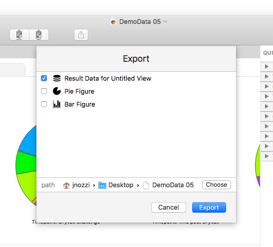

## Exporting Data

The primary workflow in SPICE ends in the exportation of figures - and possibly result data - for presentation and publication. As such, SPICE makes exporting easy and uses industry standard, widely-compatible export formats.

### Formats

**Figures** and **Canvases** are exported as resolution-independent, print-quality, decomposable, vector PDF graphics. This means you can not only use them in a variety of desktop publishing and presentation applications for pixel-perfect display and printing, but you can also use your favorite vector graphic editing application to customize the graphics further. 

SPICE isn't a "drawing app" - that's not its focus - so we recognize the need for post-processing to fine-tune your graphics. That's why it's important to us that any vector graphic editor that accepts PDF graphics (either by import, drag-and-drop, or pasting from the pasteboard) can be used to edit individual elements within the graphic to meet your post-processing needs. Don't like the font? Change it. Want to call out a pie slice? Grab it and move it out from the center, maybe throw in a drop shadow for drama and suspense. Every element in an exported SPICE figure is its own "object" in its own "layer", so every slice, bar, line, point, title, and so on, is editable. Of course it's easy enough to open an exported PDF in macOS's Preview app and export it as PNG, JPG, etc.

A brief, non-exhaustive, and impartial example of applications that can edit SPICE graphics down-to-the-dots:

* [Sketch](https://www.sketchapp.com)
* [Intaglio](https://www.purgatorydesign.com/Intaglio/)
* [Adobe InDesign](https://www.adobe.com/products/indesign.html)

**Result Data** used in your figures can also be exported as tab-separated text for use in any application that allows importing (via text file, paste, or drag-and-drop) of tabular data or any text editor.

A brief, non-exhaustive, and impartial example of applications that can work more easily with tabular text tables (simple text editors excluded):

[JMP](https://www.jmp.com/en_us/home.html)
[XTabulator](https://www.bartastechnologies.com/xtabulator)
[Excel](https://products.office.com/en-us/excel)

### Methods

SPICE gives you three main methods for exporting, which are detailed below.

#### Drag-To-Export

Figures can be dragged from the outline view directly into a Finder folder, the Desktop, or any application that accepts dropped PDF graphics.

#### Copy / Paste

Figures can be copied onto the pasteboard by selecting the figure in the outline (or in a canvas) and pressing Command-C (the Command key and the C key) or by choosing Copy from the Edit menu. You can then paste the figure as a PDF graphic into any application that accepts pasted PDF graphics.

The result data of a query group can be copied (as a tab-separated text table) by selecting the query group or any of its figures in the outline and pressing Command-Option-C (the Command key, the Option key, and the C key) or by choosing Copy Result Table from the Query menu. You can then paste the text table into any text editor or any application that accepts pasted tabular text tables.

#### The Export Panel

For more detailed control, and to export more than one item at a time, you can press the Export button in the toolbar (or press Command-E, or choose Export from the File menu) and the Export sheet (seen above) will appear.

Here you can choose which items to export. The items that appear here are affected by the selected item in the Outline or Canvas views. In the Outline view, a selected figure or query group will show you the query group and all figures (that is, whether you select a query group or one of its figures, the entire query group and its figures are displayed). In the Canvas view, the entire canvas and all its referenced figures are available. You can choose to export one or all of the items by checking the boxes next to each.

The path control allows you to specify the parent folder into which to export the selected items. Once you've made your selections, click Export. The items will be exported in their appropriate formats in the location you specified.

> Note: In the case of Canvas mode, selecting the canvas for export will export the entire canvas as one PDF graphic, which is just as detailed and compatible as individual figure graphics. As a PDF, however, a canvas with many and/or detailed figures may be quite a large file.

[Return to Guide Index](guide)
