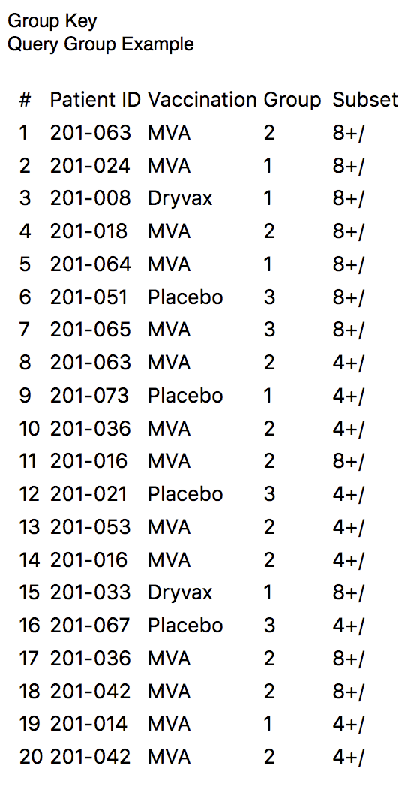
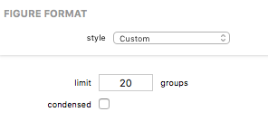

## Group Key Figures

A Group Key figure displays a table of the Groups.

### Formatting Options

A Group Key visual appearance and test parameters can be edited in the Figure Format panel when the bar figure is selected. Each control is described below.

The *limit* field allows you to specify the maximum number of groups to display in the key.

The *condensed* checkbox, when checked, results in a simple two-column key with the group number and a condensed description of the group. When unchecked, the table shows a column for the group number and one column for each group variable.

[Return to Figure Types Index](guide-figuretypes) &middot; [Return to Guide Index](guide)
