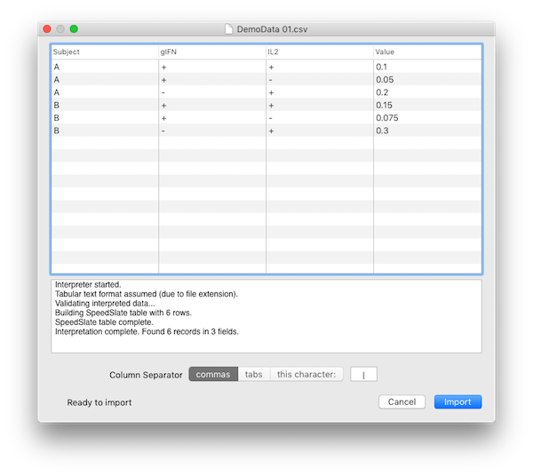

## Importing

To import [properly formatted data](dataformat) into SPICE is as simple as opening the file. You can do this via the File menu or by dropping a file onto SPICE's application icon. SPICE will then present the import window.

In the example image, we are attempting to import the file contents of Demo Data 1 from the original CSV document. Because the file extension is `csv`, SPICE assumed the separator was a comma and correctly interpreted the data and presented it in the table. The extensions `tab` and `tsv` will auto-select the tab character as the separator. The extensions `txt` and `dat` will also default to tabs. Beneath the table, the log view shows the interpreter's actions. When SPICE encounters problems, the log view will (usually) display helpful information. 

Due to the nature of open-format text data files, however, there is only so much an application can do in a reasonable amount of time to determine the cause. As SPICE is not designed to be a robust delimited data file manager, it will give up at the first sign of trouble so that it can quickly and clearly (as clearly as possible) notify you of the formatting problem it encountered. It's up to the user to follow the [Data Format](dataformat) guide and use a text editor to fix the formatting error.

The Column Separator control allows you to override the detected (or guessed) separator character. You can choose from the convenient "usual suspects" of commas or tabs, or choose a custom character by typing it in the field after choosing "this character:". You can only use one character as the separator, so SPICE will only allow one character to be entered here. With each change (clicking the control or changing the character), SPICE will immediately begin reinterpreting the data with the current settings.

When the data looks to be properly interpreted, you may click the Import button. SPICE will close the import window and open a new untitled document containing your newly imported data. 

> Note: Initially, there is only one "Untitled Query" displayed in the outline view without figures. Because there are no figures, the query is not executed. This allows you to edit the query structure (to avoid computing an enormous set of result categories with all variables set to Categorical) before adding any figures. If your data set is small, you can go ahead and add a figure first without having to wait for a lengthy computation. This choice is up to you.

## Opening Older SPICE Documents

You can open SPICE documents from earlier versions the same way as current documents. When an older document version is opened, however, SPICE will present a message notifying you that the document is being updated. When the update is complete, a new untitled document will be created, which you can then save. This *copy-on-update* approach avoids the unfortunate possibility of data corruption of your original document. Once the updated document is ready you can use it normally with SPICE 6.

> Note: Some features have changed between version 5 and 6. Although version 6 attempts to present your document as faithfully to the original as possible, some formatting settings may have changed. Please verify all settings carefully when updating a document.

*****

[Return to Guide Index](guide) | [Previous](guide-uioverview) | [Next](guide-managingquerygroups)
