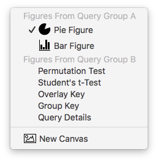

## Managing Canvases

Canvases, like [figures](guide-managingfigures), are SPICE's graphical output with one difference: a canvas is a composition of figures that can be exported as one PDF graphic. Canvases are useful when you want to compose multiple figures into one space. This seems unnecessary considering the Outline view keeps all of a query group's figures together in one space until you consider mixing figures from *multiple* query groups.

This powerful feature - new to SPICE 6 - gives you complete freedom to place your figures anywhere within a canvas. Stack them vertically, place them side-by-side, condense them into a tight fit - this extra flexibility gives you the ability to explore your data in a way that's more convenient to you.

Even better, you can select referenced figures in a canvas and change their formatting without leaving the canvas or Canvas view mode. Query changes will update any canvas that references that query's figures.

Just like a figure, when exported (see Exporting below), canvases are print-quality PDF vector images that can be used in any modern application that accepts graphics and even "broken down" and further customized with any vector graphics application that can work with PDF.

> Note: An exported canvas with complex or numerous figures will result in quite a large PDF file. Of course you can always export single figures or use macOS's Preview app to open the PDF and convert it to a PNG, TIFF, or JPG, sacrificing editability and quality for smaller file size if this is a concern.

To work with canvases, you must switch your document to [Canvas view mode](guide-uioverview) using the view control in the toolbar (the leftmost control in the default toolbar).

This guide covers managing canvases - that is, adding, removing, exporting, etc. of canvases themselves. To learn how to use a canvas (work with its figures), see the [Using Canvases](guide-usingcanvases) section.

### Adding

Clicking the **+** button in the toolbar presents you with a menu as shown below.

Choose New Canvas. The new canvas will appear and a corresponding tab will appear beneath the toolbar, above the canvas view. Each canvas exists in its own tab and you can add as many as you wish.

### Duplicating

To duplicate a canvas, select the canvas by clicking its tab and press the duplicate button (the middle button in the asset control in the toolbar). The duplicate will be added and selected.

### Deleting

To delete a canvas, select the canvas by clicking its tab and press the delete button (the rightmost button in the asset control in the toolbar). The canvas will be removed.

### Renaming

To rename a canvas, select it by clicking its tab, then click the name inside the tab. A name field will appear. Type the new name and press return to change it or press escape to cancel. You *must* first select the canvas before you can click the name to rename it.

### Undo

Each of the above actions is undoable.

### Exporting

A canvas can be exported as a print-quality PDF vector graphic for use in any application that accepts vector graphics. You can also use the Copy command to place the PDF graphic onto the pasteboard for pasting into any application that accept pasted graphics (but make sure the canvas itself is selected and not just a figure within it). You can also use the Export button in the toolbar. You can even use a vector graphics application to "break down" the graphic into its individual elements (for example, each slice in a pie figure, or each point in a bar figure) for further customization. See the [Exporting](guide-exporting) section of the User Guide for more details.

[Return to Guide Index](guide)
