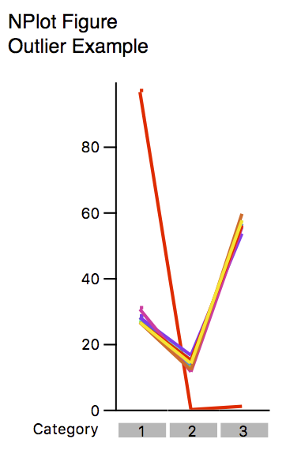
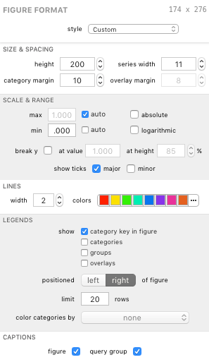

## NPlot Figures

The nPlot figure allows you to assess variability and identify outliers. Each point represents a category. Each line connects the values across each category. When there are one or more [grouped](analysis-summingandaveragingversusgrouping) variables, each line represents one member of all the combinations of the parameters of all grouped variables. In the case of one or more grouped variables, a legend can be added, identifying each group instance.

In the example above, the purple line is clearly an outlier and, though not depicted, the legend identifies this as "Subject J".

### Formatting Options

An NPlot's visual appearance can be edited in the Figure Format panel when the bar figure is selected. Each group is described below.

#### Size &amp; Spacing

The *height* field controls the total height of the **plot area** of the figure. The figure itself will be taller, depending on selected formatting options (such as legends, etc.).

The *series width* field controls the width of the area available to groups of points.

The *category margin* field controls the spacing between each category (each group of points).

The *overlay margin* field controls the spacing between overlays (each bar within a category when overlays are displayed).

> Note: The series width and overlay margin settings exist in the NPlot figure primarily so they can be adjusted to match an accompanying Bar figure's dimensions for presentation purposes. The series width and category margin settings for an NPlot are functionally equivalent and this therefore makes one superfluous without the Bar figure alignment considerations. The overlay margin is largely irrelevant due to the nature of overlaid NPlots (one NPlot is created for each overlay vs. combining into one figure as with Bar figures).

#### Scale &amp; Range

The *max* and *min* controls allow the figure to determine the best scale in *auto* mode and allow you to specify a value for each in *pinned* mode using the fields beside each control.

The *absolute* checkbox displays the data in absolute scale; uncheck to display in relative scale.

The *logarithmic* checkbox displays the data in logarithmic scale.

The *break y* controls allow you to break the scale along the y axis. Check the checkbox to enable this feature. Use the fields to specify the data value and height (in terms of percent of plot area height) for further customization.

The *show ticks* boxes affect the display of the y axis scale. You can toggle major and minor ticks.

#### Lines

The *width* field controls the width (in screen points) of the lines. A larger number means a "heavier" line.

The *colors* control allows you to manage the color scheme used for the lines (one line and one color per group). Colors are discussed more in [Color Schemes](guide-colorschemes).

#### Legends

Legends can be displayed for various properties of the figure.

The *show* checkboxes allow you to toggle specific legends on and off.

The *positioned* control lets you choose the position of the legends, as a whole, relative to the pie or pies.

The *limit* field controls the maximum number of items to show in the shown legends.

The *color categories by* control lets you select a pie figure (if any exist) whose category color scheme your category legend can borrow. When a pie figure is selected the category legend and category key (if shown) are given color keys corresponding to the color scheme defined by the pie's category color scheme. If a selected pie figure is deleted from your document, the figure remains selected here until it is deselected. This allows you to use the pie's color scheme without it appearing in your outline (and, incidentally, simplifies undo / redo behavior when deleting figures).

#### Captions

The *figure* caption checkbox shows or hides the figure's title in the exported graphic.

The *query group* caption checkbox shows or hides the figure's query group's title in the exported graphic.

*****

[Return to Figure Types Index](guide-figuretypes) | [Previous](guide-bar) | [Next](guide-coolplot)
