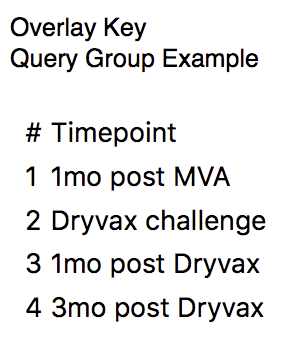
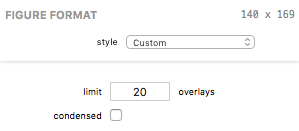

## Overlay Key Figures

A Overlay Key figure displays a table of the overlays.

### Formatting Options

A Overlay Key visual appearance and test parameters can be edited in the Figure Format panel when the bar figure is selected. Each control is described below.

The *limit* field allows you to specify the maximum number of overlays to display in the key.

The *condensed* checkbox, when checked, results in a simple two-column key with the overlay number and a condensed description of the overlay. When unchecked, the table shows a column for the overlay number and one column for each overlay variable.

*****

[Return to Figure Types Index](guide-figuretypes) | [Previous](guide-categorylegend) | [Next](guide-grouplegend)
