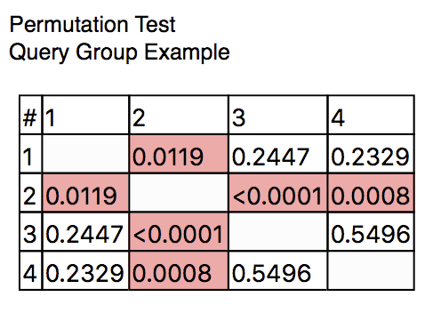
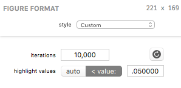

## Permutation Test Figures

A Permutation Test figure displays a table of the results of a permutation test as described in the [Analysis](analysis-comparingoverlays) section. The figure runs a permutation analysis when two or more overlays are present.

### Formatting Options

A Permutation Test's visual appearance and test parameters can be edited in the Figure Format panel when the bar figure is selected. Each control is described below.

The *iterations* field specifies the number of permutation test iterations to run. The higher the number of iterations, the longer the test will take, so if you're running into slow performance when rendering this figure, try reducing the number of iterations. Testing has revealed that 10,000 iterations provides a nice balance between accuracy and performance.

The *reload* button (to the right of the *iterations* field) forces the figure to re-run the test and update in place (without recomputing the entire query or affecting other figures).

The *highlight values* control affects how *p* values are highlighted. In *auto* mode, all values lower than 0.05 / *i* (where *i* is the number of iterations) will be highlighted. In *< value:* mode, the value specified in the text field will be used.

> Note: It is perfectly normal for the numbers to be different each time the test is run. This is a *randomized* test, so the exact same results should not be expected. SPICE does take care not to re-run the test too often but changes to the figure's enclosing query group's query structure or the figure's own settings will cause the test to be re-run.

*****

[Return to Figure Types Index](guide-figuretypes) | [Previous](guide-coolplot) | [Next](guide-wilcoxon)
