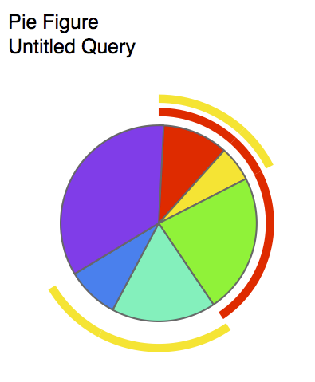
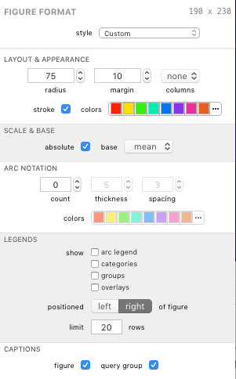

## Pie Figures

The pie figure represents fractions of the *total response* across all categories. Each slice represents a single category. The basic pie chart features a customizable size and color scheme. In addition, *pie arcs* can be enabled, which identify slices of the pie which represent certain [parameters](guide-guide-variablessparamsroles) for each of the first variables that are shown. The slices identified are those which represent the first parameter for that variable. In the example above, `gIFN +` and `IL2 +` are depicted. When pie arcs are enabled, an `arc legend` can also be displayed. When a pie figure represents a query with overlays, one pie will appear in the figure for each overlay.

### Formatting Options

A pie's visual appearance can be edited in the Figure Format panel when the pie figure is selected. Each group is described below.

#### Layout & appearance

The *radius* and *margin* fields affect the size and padding around the pie or pies in the figure.

The *columns* control allows you to choose to stack multiple pies in a figure (as is the case with overlays). A setting of *none* (default) will create one row of pies. The settings *1-10* will arrange the pies in matrix with the given number of columns.

The *stroke* setting toggles a line stroke around the edges of each slice. Depending on your needs a stroke may or may not look appropriate and so can be disabled.

The *colors* control allows you to manage the color scheme used for the pie slices (assigning a color to each category). Colors are discussed more in [Color Schemes](guide-colorschemes).

#### Scale &amp; Base

The *absolute* checkbox presents the pie with absolute scale. Unchecking this box presents the pie in relative scale.

The *base* control allows you to specify a base of *mean* or *median* for the pie.

#### Arc Notation

The *count* field specifies the number of arcs to show (how many of the first n variables for which arcs should be shown).

The *thickness* field specifies the thickness of the arcs in points.

The *spacing* field specifies the spacing between arcs (and between the innermost arc and the pie).

The *colors* control allows you to manage the color scheme used for the arcs. Colors are discussed more in [Color Schemes](guide-colorschemes).

#### Legends

Legends can be displayed for various properties of the figure.

The *show* checkboxes allow you to toggle specific legends on and off.

The *positioned* control lets you choose the position of the legends, as a whole, relative to the pie or pies.

The *limit* field controls the maximum number of items to show in the shown legends.

#### Captions

The *figure* caption checkbox shows or hides the figure's title in the exported graphic.

The *query group* caption checkbox shows or hides the figure's query group's title in the exported graphic.

*****

[Return to Figure Types Index](guide-figuretypes) | [Previous](guide-managingfigures) | [Next](guide-bar)
