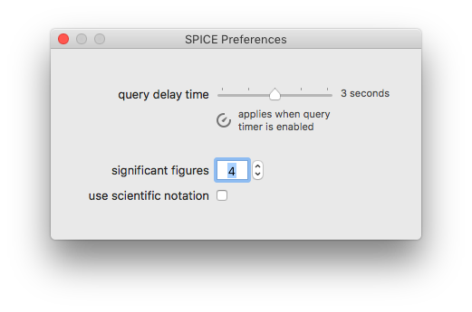
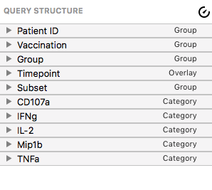

## Preferences

SPICE has several user preferences that can be changed in the Preferences window. You can access the preferences by choosing Preferences from the SPICE 6 application menu, or by pressing Command-, (the Command key and the comma key).

### Query Delay Time

This preferences applies to the query update timer - it sets the length of the delay when the timer is enabled. The query update timer can be enabled by clicking the timer icon in the upper-right corner of the [Query Structure](guide-querystructurecontrols) panel, shown below.

### Significant Figures

This field controls the number of significant figures SPICE shows when rendering numbers in figures.

### Use Scientific Notation

Checking this box causes SPICE to display numbers rendered in figures using scientific notation (respecting the significant figures preference).

[Return to Guide Index](guide)
