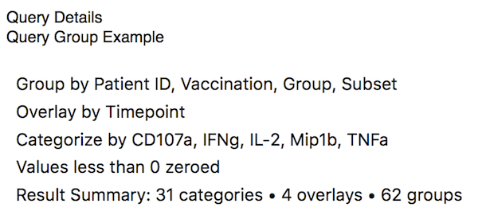

## Query Description Figures

A Query Description figure displays a description of the query group's query structure. This figure has no formatting options.

[Return to Figure Types Index](guide-figuretypes) &middot; [Return to Guide Index](guide)
