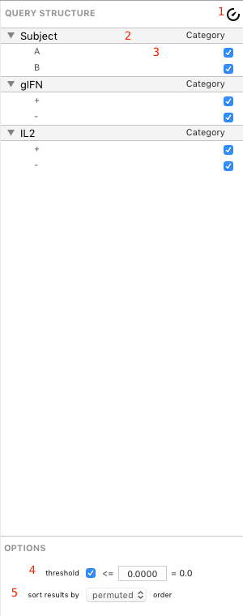

## Query Structure Controls

The query structure of a query group can be configured by selecting the query group in the outline and using the Query Structure panel shown below.

1. Auto-Update Delay Control
2. Variable
3. Parameter
4. Thresholding Options
5. Sort Order Options

-----

### Variables

Variables appear in the list with a gray background. Each variable shows its name (left) and role (right). Variables can be reordered by drag and drop (this will [change the sort order](analysis-categoryorder) of the result categories). You can change the [role](guide-variablessparamsroles) of a variable by clicking the role (*Category* is the default role) to *Sum*, *Average*, or *Group*. This is a very important function of SPICE and is discussed in more detail in in the [Analysis section](analysis-summingandaveragingversusgrouping). More details about variables, parameters, and roles are discussed [here](guide-variablesparametersroles).

> Tip: For convenience, you can hold the Command key on your keyboard while clicking a variable's disclosure triangles to expand or collapse *all* variables at once.

### Parameters

Parameters, like variables, appear in the list but have a white background and a smaller, lighter font. A parameter belongs to a variable (it is the "value" of the variable) and must have at least one parameter. Each variable shows its name (left) and its inclusion status in the query. Also like variables, parameters can be reordered by drag and drop within their respective variables (that is, you cannot drag a parameter to another variable, only change its order within its variable).

A parameter can be ignored by unchecking the inclusion checkbox. This means any measurements falling under this parameter will not be included in the query, computation, or plotted figures. For example, in the `Demo Data 1` example file, unchecking `Subject: A` would cause all data for `Subject: A` to disappear from the query (the data are still in the document, they are simply ignored) and the resulting figures, leaving only `Subject: B`.

> Tip: Because this is a very frequently used function, there are a number of shortcuts to make parameter inclusion easier to work with. You can right-click any variable to see a contextual menu that allows you to invert the inclusion (if some are unchecked), include all (if some are unchecked) or include only the right-clicked parameter. You can also double-click any parameter to include only that parameter within a variable.

 More details about variables, parameters, and roles are discussed [here](guide-variablesparametersroles).

### Thresholding Options

The thresholding controls in the Options section at the bottom of the Query Structure panel allow you to turn thresholding on or off, and to set the threshold level by editing the text field. [Thresholding](analisys-thresholding) is discussed in depth in the Analysis section.

### Sort Order Options

The sort order control in the Options section at the bottom of the Query Structure panel allows you to choose the default sort order of the result categories. [Catgory sort order](analysis-categoryorder) is discussed in depth in the Analysis section.

### Auto-Update Delay

The auto-update delay control, when enabled, delays updating your query for a short time (specified in [Preferences](preferences)). This allows you to make a series of subsequent changes without waiting for a complex, long-running query to complete. Any query change will start the timer and subsequent changes before timeout will simply reset the timer, waiting for additional changes; if no further changes are made in the time alloted, the query is updated. When disabled (the default setting for new documents), all changes to the query structure cause an immediate update.

> Note: You can force a query to update immediately by pressing Command-R (the Command key plus the R key) on your keyboard. This can also refresh a figure that was misdrawn due to an interruption in computation.

*****

[Return to Guide Index](guide) | [Previous](guide-managingquerygroups) | [Next](guide-variablessparamsroles)
