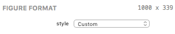
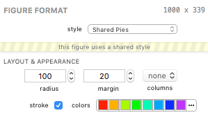
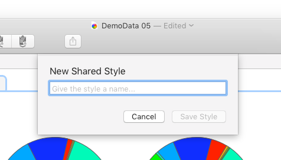
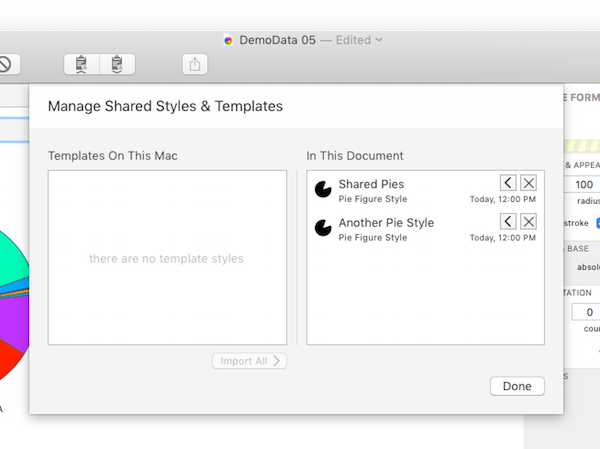

## Shared Styles

In SPICE 6, a figure's current formatting can be considered its "style". Each figure has its own style but it can be beneficial to share a style between figures of the same type. For example, you may have several query groups, each with a pie figure, and wish to have all pie figures share the same formatting options (style) so that changing a formatting option in one pie affects all pies sharing the same style. SPICE 6 allows for this using a concept called *Shared Styles*. 

A shared style is a stored copy of a figure style that can be used by more than one figure of the same type. That is, a pie figure's style can be *promoted* to a shared style and any other pie figure in your document can use *that* style instead of its own. If you change the color scheme in one pie using this shared style, all other pies using the same style will be updated to match. The same goes for bar figure styles, and styles for every other figure type.

Shared styles are available to figures within the same document but they can be promoted one step further to *templates* available to any documents opened on your Mac under your current user account, allowing you to "pull down" template styles into your documents as shared styles. See the Managing Shared Styles section below for more information.

You can choose or manage a shared style for the selected figure using the control in the example above - it's found at the top of the Figure Format panel. The *style* control is set to *Custom* for each figure by default.

The control presents a list of all shared styles for the selected figure type, the *Custom* option, and the option to save a custom style as a shared style as well as to manage the shared styles. Each topic is covered in more detail below.

### Using Shared Styles

In the example above, the selected pie figure is using a shared style called Shared Pies. This is indicated by the Shared Pies style being selected in the *style* control and by the "caution tape" banner, *"this figure uses a shared style"*. When this banner appears, you know that any changes you make to this figure's formatting will affect any other figures sharing the Shared Pies style.

To choose a shared style (if any are available), simply select the style in the *style* control.

To change a figure back to using its own style (not a shared style), simply choose the *Custom* option in the *style* control. The shared style's settings will remain but the sharing banner will disappear and the figure will now have its own custom style. Changes to this figure's formatting will now affect *only* this figure.

### Creating Shared Styles

To "promote" a figure's custom style to a shared style, choose Save As Shared Style… from the *style* control. A dialog will appear as seen above. Give the style a unique name (no two shared styles of the same figure type can have the same name) and click Save Style. The new shared style will be created using the figure's current custom formatting options and the figure will now use that shared style.

### Managing Shared Styles

To manage shared styles, choose Manage Shared Styles… from the *style* control. A sheet will appear as shown above. 

The list on the right ("In This Document") shows all the shared styles (for all figure types) within the document. The list on the left ("Templates On This Mac") shows any shared style templates available to any document on your Mac, under your current user account (think "favorites").

You can rename or delete shared styles in the "In This Document" list. You can also click the left arrow to promote a shared style to a template. The new template will appear in the "Templates On This Mac" list. The new template is now available to copy into any document you open. To do so, open the target document, open the shared styles manager sheet, then click the right arrow on the template you wish to import. The template will then be copied into your document as a shared style. Click Done to close the manager sheet and then select the shared style in each figure with which you wish to use it.

You can also delete templates using the X button next to each template. Additionally, you can use the Import All button to import all template styles into the current document at once.

> Note: If you delete a shared style in the manager that is currently in use by one or more figures in the document, those figures will automatically be set to *Custom* styles with the shared style's current settings.

### Copying Styles

You can also copy a style between figures within the same document or figures in another document without using a shared style by using the Copy and Paste Style control in the toolbar. To copy a figure's style, select it then click the Copy Style button. To paste, select the target figure and click the Paste Style button. The Paste Style button is only available if the selected figure is the same type as the style that was copied.

[Return to Guide Index](guide)
