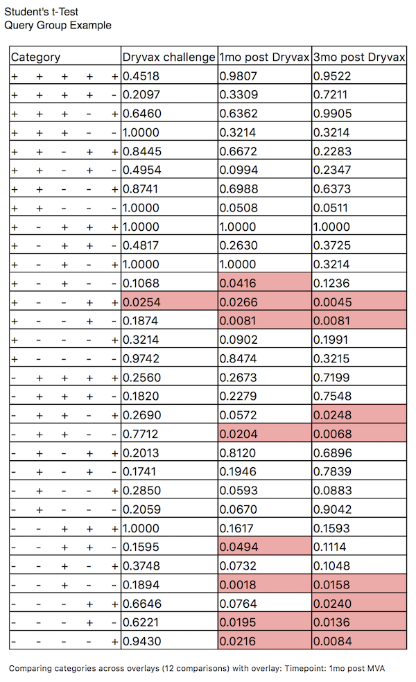
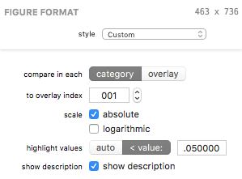

## Student's t-Test Figures

A Student's t-Test figure displays a table of the results of a Student's t-Test.

### Formatting Options

A Student's t-Test's visual appearance and test parameters can be edited in the Figure Format panel when the bar figure is selected. Each control is described below.

The *compare in each* control selects the mode of comparison. The *category* mode compares each category in the selected overlay index (see below) to the same category in each other overlay. The *overlay* mode compares the selected category index (see below) to all others within its overlay, for all overlays.

The *to overlay/category index* field allows you to select the comparator category or overlay (depending on the mode selected by the *compare in each* control).

The *scale* *absolute* checkbox controls whether to use absolute (checked) or relative (unchecked) scale for the test. The *logarithmic* checkbox controls whether to use logarithmic scale.

The *highlight values* control affects how *p* values are highlighted. In *auto* mode, all values lower than 0.05 / *i* (where *i* is the number of iterations) will be highlighted. In *< value:* mode, the value specified in the text field will be used.

The *show description* checkbox, when checked, adds a summary description of the test beneath the table, as shown in the example above. Specifically, the example images (both the figure and the format controls) reflect the test settings: *"Comparing categories across overlays (12 comparisons) with overlay: Timepoint: 1mo post MVA"*.

*****

[Return to Figure Types Index](guide-figuretypes) | [Previous](guide-wilcoxon) | [Next](guide-categorylegend)
