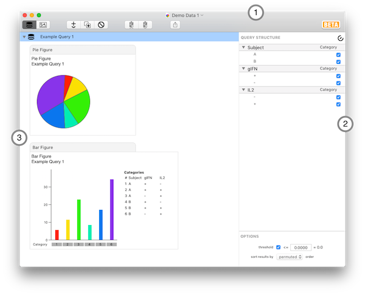
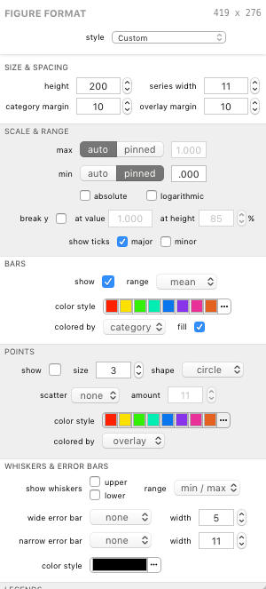
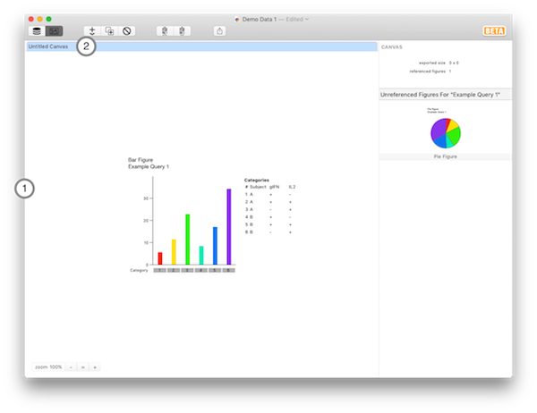

## User Interface Overview

### Document Window: Outline View

1. Toolbar
2. Outline View
3. Inspector Panel

The above image shows the inspector pane when a query group is selected (ie, the query structure panel). When a figure is selected, the inspector panel displays the figure format panel. In this example, a bar figure is selected, so the formatting controls appropriate to a bar figure are shown.

### Document Window: Canvas View

1. Canvas View
2. Tab Bar

*****

[Previous](guide) | [Next](guide-importing)
