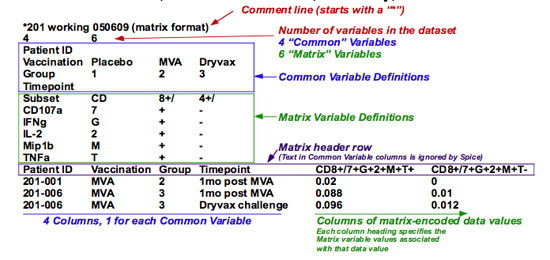
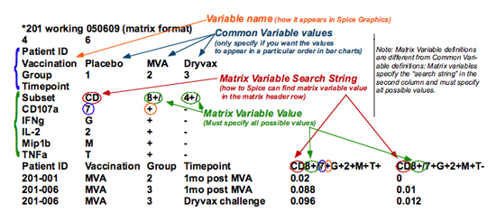

This is probably the most common and easiest way to enter data into SPICE. Following the detailed description below is a graphical example that illustrates the elstrongents of this data format. Create a text file (using Word or Excel) that conforms to the following formatting rules. Note that you can insert comments in the file by starting any line with an asterisk ("*"); these lines are completely ignored irrespective of where they occur. The references to line numbers below are taken to indicate the line number ignoring any comments. Thus, "Line 1" means the first line of the file that does not contain a comment line.

    Line 1: The number of different variables that are not in the matrix (= n), followed by a tab, followed by the number of variables in the matrix (= m).  
    Lines 2 through n+1: Variable definitions of the non-matrix variables (“Common Variables”).  
    Lines n+2 through n+m+1: Variable definitions of the “Matrix variables”. Here you need to specify, in tab-separated columns: the variable name (as above), how that variable name is encoded in the matrix header row, and then all possible values of the variable.  
    Line n+m+2: The matrix header row. The first n columns of this row are ignored (they correspond to the non-matrix variables). The following m columns indicate what the variable values are for the numbers in that column. See below for formatting.  
    Lines n+m+2 to end: Specifications and values.

To enter data as a matrix of values, you must specify two values on the "Line 1", or number of variables, separated by a tab. The first value is the number of variables that are not part of the matrix, referred to as Common Variables (since they specify values that are common to many different data values). The second value is the number of variables that are encompassed by the matrix, referred to as Matrix Variables. Then, specify the variable definitions; there is a slight difference from the above specification for those variables which are encompassed by the matrix. Then provide the matrix header row, and then the matrix values.

<table border="1" align="center" cellspacing="0" cellpadding="3">
	<caption>Fig. A: Sample Data Set</caption>
	<tr>
		<td colspan="5" align="left">* Sample data set</td>
	</tr>
	<tr>
		<td width="20%" align="left">1</td>
		<td width="80%" colspan="5" align="left">3</td>
	</tr>
	<tr>
		<td width="20%" align="center">Stimulation</td>
		<td width="20%" align="center">Env</td>
		<td width="20%" align="center">Gag</td>
		<td width="20%" align="center">Pol</td>
		<td width="20%" align="center">Nef</td>
	</tr>
	<tr>
		<td width="20%" align="center">CD107</td>
		<td width="20%" align="center">7</td>
		<td width="20%" align="center">+</td>
		<td width="40%" align="center" colspan="2">-</td>
	</tr>
	<tr>
		<td width="20%" align="center">TNF</td>
		<td width="20%" align="center">T</td>
		<td width="20%" align="center">+</td>
		<td width="40%" align="center" colspan="2">-</td>
	</tr>
	<tr>
		<td width="20%" align="center">IL2</td>
		<td width="20%" align="center">2</td>
		<td width="20%" align="center">+</td>
		<td width="40%" align="center" colspan="2">-</td>
	</tr>
	<tr>
		<td colspan="5" align="left">* Data values follow</td>
	</tr>
	<tr>
		<td width="20%" align="center">&nbsp;</td>
		<td width="20%" align="center">7+T+2-</td>
		<td width="20%" align="center">7+T+2+</td>
		<td width="20%" align="center">7-T+2+</td>
		<td width="20%" align="center">7-T-2+</td>
	</tr>
	<tr>
		<td width="20%" align="center">Env</td>
		<td width="20%" align="center">.05</td>
		<td width="20%" align="center">.1</td>
		<td width="20%" align="center">.2</td>
		<td width="20%" align="center">.3</td>
	</tr>
	<tr>
		<td width="20%" align="center">Gag</td>
		<td width="20%" align="center">.1</td>
		<td width="20%" align="center">0</td>
		<td width="20%" align="center">.1</td>
		<td width="20%" align="center">-.05</td>
	</tr>
	<tr>
		<td width="20%" align="center">Nef</td>
		<td width="20%" align="center">.3</td>
		<td width="20%" align="center">.4</td>
		<td width="20%" align="center">.1</td>
		<td width="20%" align="center">.4</td>
	</tr>
</table>

For example, consider the data set shown above (*Figure A*). The first line shows that there is one Common Variable, and 3 Matrix Variables, for a total of 4 variables.

The next line shows the name of the Common Variable, and the values it may have.  You need not specify the values; by specifying them, you force SPICE to graph them in the order you list.

The next three lines give the three Matrix Variables. The first column is the display name of the variable; the second column shows how that variable is encoded in the matrix header row; the remaining columns show the possible values of each variable. All values must be listed. Values for any given variable value *cannot* start with another value for that same variable; i.e., you can’t have the values “A” and “AB” for the same variable, as “AB” contains “A”.

The next line is the matrix header row. The first column here is ignored, as it corresponds to the stimulation column in the data set (not encoded in the matrix). In general, the first n columns, corresponding to the common variables, will be ignored, as their names have already been defined. The next columns identify the variable values to assign to values of that column. Note that the order of the specified variables in the matrix header row must be the same as the order in the definitions list (in this table, 7, followed by T, followed by 2).

This is followed by the matrix itself. Each row in the matrix specifies the values of the common variables (all data values on that row will share those variable values) followed by the matrix encoded data values.

Note: the matrix example data set could be encoded in the columnar format as shown here. The exact same information is encoded, but there is more duplication of text in that the common variable values must be re-specified for every single data value. There is one advantage of the columnar format: missing daa values can occur. In the matrix format, an empty cell is considered a measurement of zero; this is not the same as a missing value, which SPICE treats as a non-measurement that does not enter into the statistical calculations.

Shown below is a graphical illustration of the various elements of a matrix-encoded data file. This is actually the data included with the documentation, from the file `DemoData 04.txt`. Only a portion of this file is shown for clarity.

Fig. B: Major components of the matrix format  

*Figure B* shows the various major components of the data file: the optional comment line (the first few comment lines will be drawn in the SPICE Window to help identify the data set); the definition of the number of variables; the common variable definition lines; the matrix variable definition lines; the matrix header row; and finally, the matrix itself.

Fig. C: Variable definitions of the matrix format  

*Figure C* shows the variable definitions. All variable definitions begin with the variable name. The text in this first column can be anything; it is what is drawn in the SPICE Graphics (and menus) to identify the variables. For Common Variables, this column can be followed by the values; you do not need to specify all (or even any) of the possible values; SPICE will determine the range of values by looking at the matrix. However, you can control the order of the bars (categories) in the Bar Charts by specifying the order of the values manually.

Matrix variables have a different definition. Here you must teach SPICE how to find the matrix variable values from the column in the matrix header row. The second column specifies the exact text that precedes the variable value in each column head (in the example above, "CD" precedes the value of the subset variable; "7" precedes the value of the CD107a variable; etc). Then you must specify all possible values of that variable.