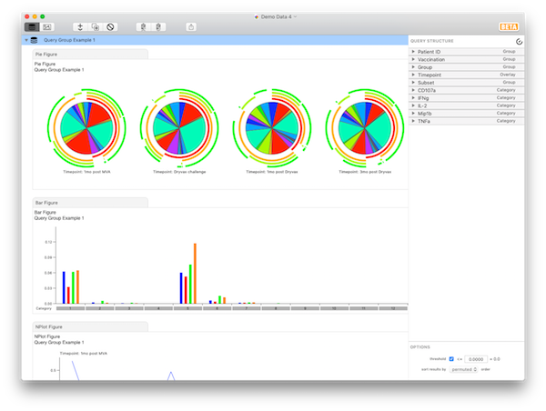
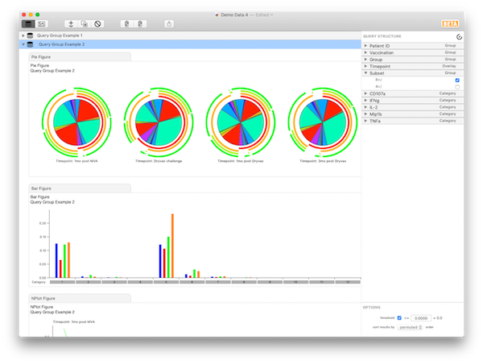
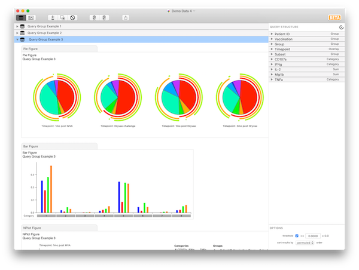
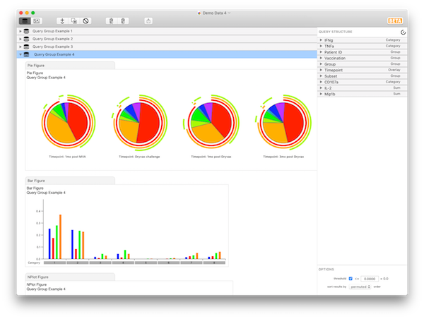
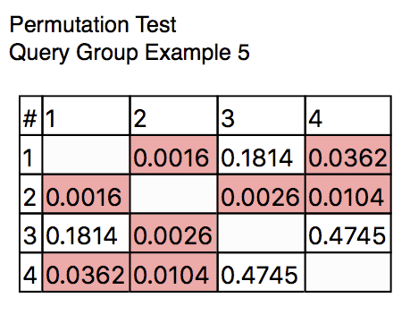
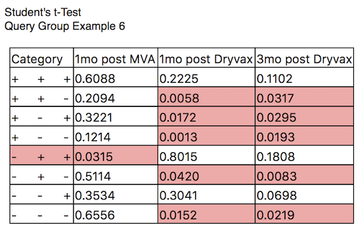
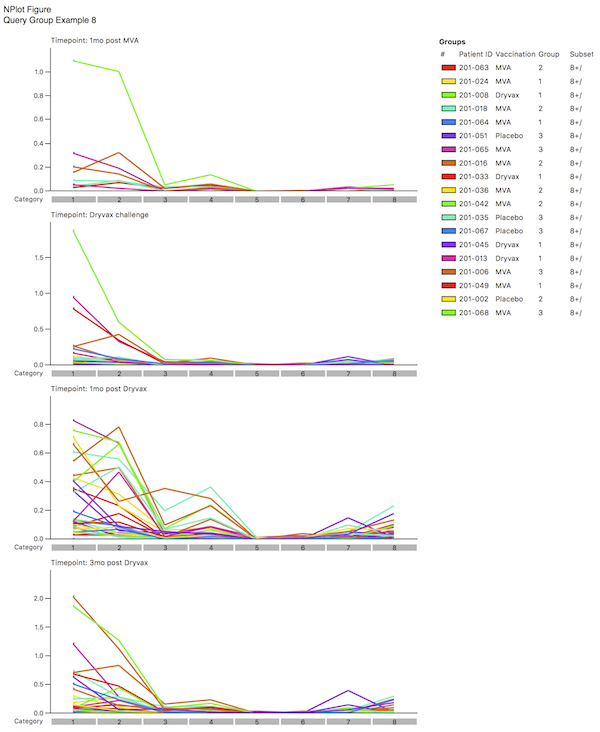
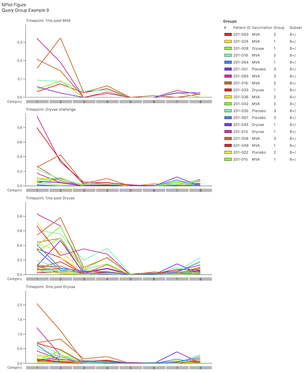

## Complex Tutorial

To follow this tutorial, open the data file `Demo Data 4`. This is a complex set of data (with thanks to Melissa Precopio), comprising a 5-functional analysis on CD4 and CD8 T cells from a vaccinia and MVA vaccination trial. There are data for over 40 patients in different arms of the study, with different time points. This tutorial will lead you through a single analysis to illustrate the power of the program.

When you open the file you'll see all of the variables are categorical by default and the complete set of combinations of all variables (the number of categories) is over 71,000. This is computationally expensive, thus you must reduce the complexity of the dataset by assigning several variables a role (such as "Overlay" or "Group"). Begin by assigning "Group" roles to "Patient ID", "Vaccination", "Group", and "Subset". Then assign an "Overlay" role to "TimePoint". The results should look like `Query Group Example 1`.

At this point, you should have 4 pie charts (for different time points), and 32 categories (the various functional subsets). Briefly, expand the "Patient ID" variable. Here, you can see all the parameters (individual patient IDs) belonging to the "Patient ID" variable, complete with controls allowing you to exclude them from the data set altogether. Now expand the "Grouped Variables" list and notice that all variables to which you've assigned a role of "Group" appear here.

Now expand the "Subset" variable. We're interested only in the "8+" parameter, so click to uncheck the "Include" option next to the "4+" parameter. At this point, you are looking at the multifunctional responses of CD8 cells, averaged over the various patients, grouped by timepoint. The results should look like `Query Group Example 2`.

If you now check "Include" for "4+" and uncheck "8+", you are looking at exactly the same display, but only for CD4 cells.

To continue the tutorial, go back to looking only at `Subset: 8+/` to show CD8 cells. Let's simplify the display a little bit. Instead of 32 response flavors, we wish to narrow it down to only 8, and look at all combinations of gIFN, TNF, and CD107a. Thus, for the variables "Mip1b" and "IL2", assign them a role of "Sum". SPICE now adds together the fractional responses that fit into each category (defined by gIFN, TNF, or CD107, averaged as defined by the averaging variables) over all possible values of IL2 and Mip1b. This is exactly as if the original data had not been split into 32 fractions, but had been split into only 8, irrespective of the contribution of IL2 and Mip1b. You should now have 8 categories. The results should look like `Query Group Example 3`.

At this point, click on any of the three remaining categorical variables, and drag to re-order them (note that, while you can reorder parameters within their variable, you can't drag them into other variables - for now, only reorder the variables themselves). If you put TNF and IFNg at the top, you will notice that all of the biggest bars (biggest responses) are grouped together at the left. This quickly reveals that most of the response for CD8 cells is IFNg+TNF+. The results should look like `Query Group Example 4`.

Now let's add a statistical analysis chart to run a permutation test. To do this, click the **+** button in the toolbar, then select *Add Permutation Test*. A new figure will be added to the outline, showing the statistical comparison of every pair of pies: showing that Pies #1 and 2 are marginally different, 2 and 3 are quite different, and 2 and 4 are marginally different. This illustrates that, for this grouping of the data, the Dryvax challenge timepoint is different, functionally, from all of the other time points. The results should look like `Query Group Example 5`.

You can explore this difference further by examining which of the categories contain significant differences between groups. First select the Bar figure then change the settings to show the individual data points and to not show bars.

Now add a *Student's t-Test* figure as you did with the Permutation Test. In the Figure Format panel, set the overlay index to `2` to compare to `TimePoint: Dryvax Challenge`. Now SPICE will compare, within each category (each response flavor) the distributions to the distribution for the selected time point. Those that are different at the selected *p* value (here, 0.05) are highlighted. For example, among the first category (5+ response), all three other are different. The results should look like `Query Group Example 6`.

Note that you could choose to compare, within each overlaid group, the distribution of data points to those in a single category. Here you could compare whether the distribution of events each category is different than that found in the first (5+) category, for each of the time points. For this analysis, such a comparison does not make much biological sense; however, for other kinds of displays, you may wish to perform such a comparison. The *compare in each* control allows you to specify how you want to perform the comparison.

The data have been appropriately thresholded to remove noise. To control (or disable) the threshold, select the query group in the outline. At the bottom of the Query Structure panel, you can toggle thresholding with the checkbox. You can also specify the threshold level (0.0 is the default). For example, specify a value of 0.01. SPICE will apply the new threshold and the figures will refresh. All values 0.01 and below will be zeroed, which balances out the zeroing of negative values. Note that the displays have not changed dramatically; the *p* values in the comparison have increased slightly, revealing that perhaps Pies #1 and 2 are not really different (but 2 is still different to both 3 and 4). Given the relatively small number of subjects incorporated in the the first Pie, this is perhaps not surprising. Choose to display data points in the Bar Chart formatting panel to see that there are only 5 subjects in that group.

Finally, let's add an NPlot figure using the **+** toolbar button. Each line in the NPlot connects the values for the data points that are averaged for the Bar charts and Pie charts; in this example, each line connects the data points for one of the subjects in the study. The colors assigned to each line are different (ranging across the visual spectrum from red to blue), and are assigned in order of the appearance of the subjects in the data file. The results should look like `Query Group Example 7`.

By selecting different coloring schemes, you can determine if there are common outliers by looking at the pattern. In the example shown here, you may decided that the lime green sample is an outlier; by examining the legend, you will note that this corresponds to a specific Patient ID. You could now choose not to "Include" this one patient and see what the effect that has on the distributions. The results should look like `Query Group Example 8`.

This concludes the tutorial.

*****

[Return to Tutorials](tutorials) | [Previous](tutorial-simple) | [Next](analysis)
