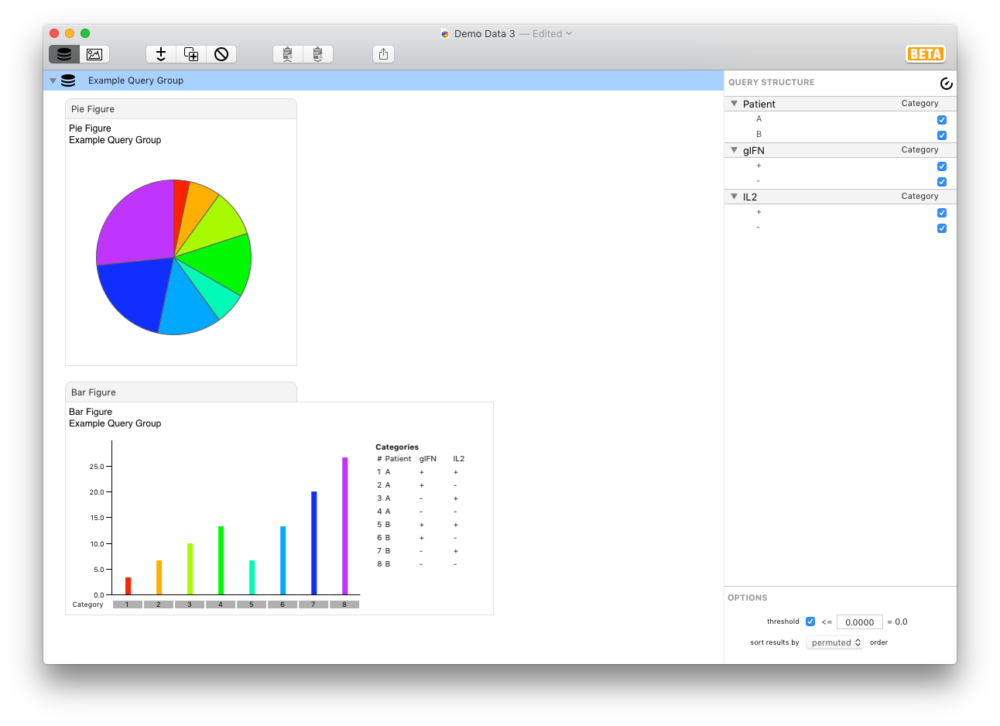

## Simple Tutorial

Begin this simple tutorial by launching SPICE and opening the `Demo Data 3` file in the Demo Data folder found in the SPICE folder. This is a simple data file with 8 values: 4 for each of 2 patients give a measurement of `IL2` and `gIFN` defined subsets (4 each, all available combinations of `IL2 +/-` and `gIFN +/-`). 

**Note:** The SPICE document named `Demo Data 3` holds pre-imported data with a prepopulated query group and associated figures for the purposes of this tutorial.

Select `Example Query Group` in the outline and direct your attention to the inspector pane at the right edge of the window.

By default, all variables are assigned a role of *Categorical* - i.e., their parameters define all possible categories from the available data set. Since there are 3 variables, each of which has 2 possible parameters, you are shown an 8-category bar chart (8 bars, and 8 slices in the pie). Note that the color of each slice in the pie is corresponds to each bar for each result category. In the default representation ("relative scaling"), the bars are scaled to be the fraction of the total, where the total is the sum across all categories. This is also represented in the Pie chart above.

Now assign the "Overlay" role to the variable "Patient" in the Query Structure pane. To do this, make sure the `Example Query Group` is selected in the outline, then click the word *Category* next to the `Patient` variable and select *Overlay* role from the menu. SPICE will now generate one pie for every parameter in the overlaid variable (i.e., one for each patient) for which there are measurements in the data set. There are now 2 categorical variables, so the bar chart (and number of slices in each pie) is only 4. The bar chart shows each patient's data as an overlay graph, with a separate color for each patient. The results should look the same as shown in the query group titled `Example Query Group (Overlaid by Patient)`.

")

Note that the Bar figure shows the same bars for both patients; they have the same flavor of response. Each figure type in SPICE has a number of formatting options to customize the display. In this case, we'd rather use absolute scale. To do this, select the Bar figure in the outline and note the options in the inspector. Scroll to the Scale &amp; Range section and click to check the *absolute* checkbox. Note that the Y axis scaling changes to reflect the absolute numbers, and the two subjects now appear different: they have different magnitude responses. However, in this case, the Pie figures still are identical, as they will always reflect the flavor of the response. The results should look the same as shown in the query group titled `Example Query Group (Overlaid by Patient / Absolute)`.

")

Change the role of the Patient variable to *Average*. Now there is a single Pie figure, with 4 slices. Again, there are 2 categorical variables, leading to 4 categories. Each category is averaged over the variable `Patient`; i.e., each bar represents the average of `Patient A` and `Patient B`. Select the Bar figure to display its format options. In the Bars section, uncheck *show*; in the Points section, check *show*. Now you can see the individual Patient's data values for each category. The results should look the same as shown in the query group titled `Example Query Group (Averaged by Patient)`.

")

If you'd like to publish or otherwise share these visualizations, you can easily do so by dragging a figure or the entire query group to the Desktop or a Finder folder to export them. You can also drag individual figures to applications that accept graphics (such as a graphics editor, or Word, PowerPoint, Pages, etc.). Additionally, you can select a figure in the outline and `Cmd-C` copy it for pasting into another application, or select and copy a query group to place the result data on the pasteboard for pasting into text editors, Excel, JMP, R, or any application that accepts pasted tab-separated data.

[View Drag To Export Demo](images/dragtoexport.mov)

This tutorial should give you a basic idea of how to use SPICE to explore your data visually as well as how to customize your plots for use in publications.

*****

[Return to Tutorials](tutorials) | [Previous](tutorials) | [Next](tutorial-complex)
