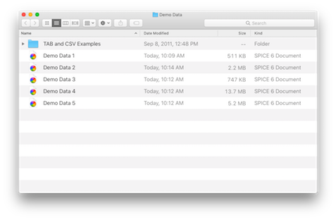

## Tutorials Overview

There are two tutorials available. The first is a relatively simple example on purely artificial data. The second is a more complex example based on "real" immunogenicity data.

The example data files are included with the distribution; you can open them in Microsoft Excel to view how the data is [formatted](dataformat). These can serve as templates for constructing your own data files.

1. [Simple Tutorial](tutorial-simple)
2. [Complex Tutorial](tutorial-complex)
